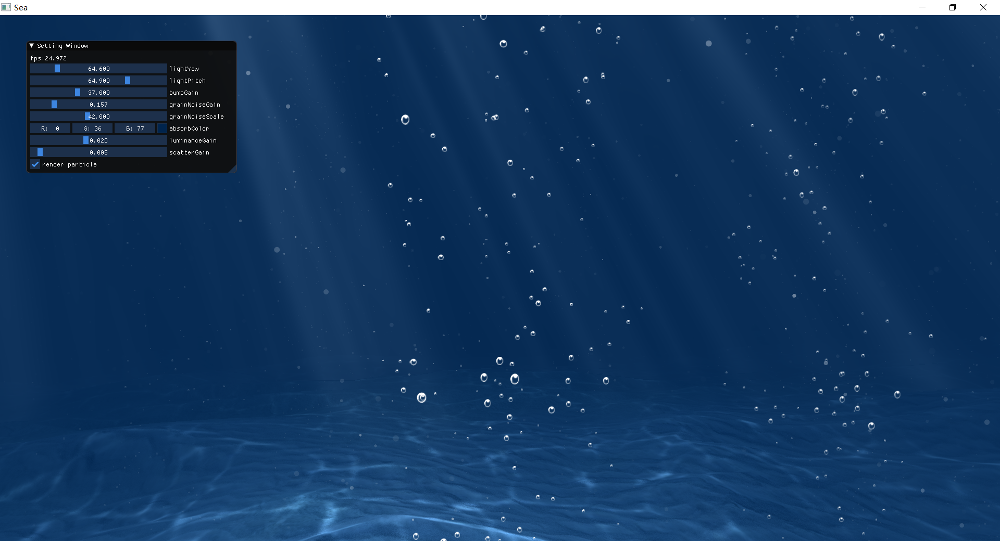

# 海底世界
    一个使用OpenGL实现的简单的海底漫游小demo

## 使用库
- 使用glm做数学运算
- 使用GLFW做窗口管理
- 使用IMGui做调试界面
- 使用GLEW做OpenGL环境加载
- 使用STBImage做纹理加载
- ...

## 实现功能
- RayMarchin实现了海底Light Shaft
- 预渲染的海底焦散
- 简单的粒子系统，实现水中气泡的渲染
- HDR CubeMap水上环境光

## 编译环境
    使用VS2015编译,其他版本VS没测试，如果不能编译需要自己替换对应的IMGui glfw glew静态和动态库

## 运行方法
    在VS2015环境下直接ctrl+F5运行，或将项目目录(OceanBeneath/OceanBeneath)下的assets文件夹拷贝到Exe统计目录双击运行。
